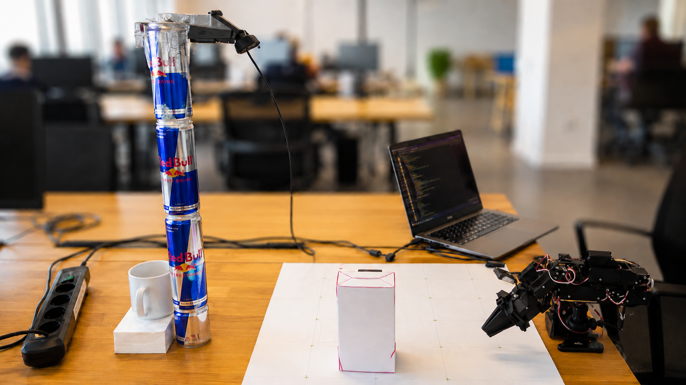

# Robotics × AI Hackathon — Berlin (NormaCore Track)

**Track:** NormaCore — *"AI-Powered Robot Control: integrate the Station API into Codex or Claude so it
can control the robot by looking through the cameras."*

**What we're building:** a **voice- and chat-commanded assistive robot** — an **agent you talk to**
that looks through the robot's cameras, works out the physical task, and **does it, correcting itself
when it fails**. **Claude is the brain**, running on the **Claude Agent SDK**; NormaCore's Station
API is wrapped as an **MCP server** so the agent can actually drive the arm. The whole thing is a **full agentic pipeline** — perceive → decide → act → verify — not a
scripted demo: give it a goal in plain language and it figures out the steps.

**What it can do today:** locate / track objects on the table, **pick up**, **place**, **stack** one
object on top of another, **drag** things across the table, push, point / hover, wave, and just look and
describe the scene — all from natural language ("bring me the box", "stack the small box on the big one").

**Talk to it (voice mode):** an optional voice agent in the web UI — speak to it, watch an animated
agent, and hear it narrate what it's doing and report back. The pipeline is **browser speech-to-text →
Claude (the same brain) → a fast parallel narrator → ElevenLabs streaming voice**, and it runs fully
decoupled from the robot's control loop so talking never slows the arm down.

**What actually runs (the reliable track):** SmolVLA was blocked on a checkpoint, so we built a
**SmolVLA-independent grid track** — Claude reads a target's **pixel** from the overhead camera and a
**pre-taught pixel→joint grid** turns it into waypoints for robot motion (no IK, no ArUco, no API key). First full
autonomous **pick-and-place succeeded on hardware (2026-06-21)**. As-built design:
[`docs/13-grid-control-implemented.md`](./docs/13-grid-control-implemented.md). *(The original two-stage
SmolVLA+IK plan is docs/10–11, kept for reference.)*

> One-liner: *Not a remote control — an assistant with eyes, judgment, and a conversation.*

<p align="center">
  
  <br>
  <em>The setup: NormaCore arm + overhead/side cameras, the rig our agent perceives and controls.</em>
</p>

<p align="center">
  🎥 <strong><a href="https://youtu.be/gKlwgUW2sTE">Watch the demo video</a></strong>
</p>

<!-- 🔴 LIVE DEMO: GitHub renders this user-attachments URL as an inline video player -->
<p align="center">
  <video src="https://github.com/user-attachments/assets/444579d8-3de0-4854-8683-e14009f0f984" controls muted width="70%" poster="./Images/inf.png"></video>
</p>

<p align="center"><em>▶️ Live demo — autonomous pick-and-place on hardware.</em></p>

## 🤗 Model & Dataset (Hugging Face)

The fine-tuned SmolVLA checkpoint and the training dataset are hosted on the Hugging Face Hub:

| Resource | Link |
|---|---|
| 🧠 **Model** — SmolVLA cube (8-dim) | [](https://huggingface.co/captainjaseel/smolvla-cube-8dim) |
| 📊 **Dataset** — Berlin Robotics Hack | [](https://huggingface.co/datasets/shubhamt0802/Berlin-Rob-hack-dataset) |

**⭐ As-built (grid track):** [`docs/13-grid-control-implemented.md`](./docs/13-grid-control-implemented.md) ·
**How Claude connects:** [`docs/11-claude-integration.md`](./docs/11-claude-integration.md) ·
**Original plan:** [`docs/10-implementation-strategy.md`](./docs/10-implementation-strategy.md) ·
**Docs index:** [`docs/README.md`](./docs/README.md).

---

## ⭐ How the setup is split across laptops (read this first)

The hardware (arm + cameras), calibration, and any model fine-tuning live on **one machine**; the rest
of us develop on our own laptops and connect to it **over the network**. You do **not** need the arm
plugged into your laptop.

| Machine | Runs | Notes |
|---|---|---|
| **Robot laptop** (has the hardware) | NormaCore **Station**, the **arm(s) + USB cameras**, **calibration**, any **SmolVLA fine-tuning** | Start Station with `station --tcp --web` so it's reachable on the LAN (`0.0.0.0:8888`). Find its IP: `hostname -I`. |
| **Dev laptops** (rest of the team) | our **MCP server**, the **Claude brain** (CLI or `agent_service`), the **web UI** | Connect to the robot laptop's Station via TCP. Set `STATION_HOST=<robot-laptop-ip>`. |

So: **calibration & training stay on the robot laptop**; everyone else points their MCP server at it.
All on the **same Wi-Fi/LAN**, port **8888** open.

> **Where does the network call go?** Only the **brain** (Claude, via the **Claude Agent SDK**) runs
> remotely. The actual **motor commands run locally**: `agent_service`/Claude decides *what* to do,
> then calls the MCP tools, which send commands to the Station over **local/LAN TCP**. Motor bytes never
> leave the LAN.

---

## Components & environments (what to install)

Each component has its **own isolated environment** — set them up independently. Nothing is shared.

| Component | Dir | Environment | Needs |
|---|---|---|---|
| **MCP server** (wraps the Station as tools) | `station_mcp/` | its own **Python venv** (`uv`) | `uv`; for LIVE mode also a cloned `norma-core` |
| **Agent service** (always-on Claude brain for the web UI) | `agent_service/` | its own **Python venv** (`uv`) | `uv` **+ the `claude` CLI installed & logged in** |
| **Web UI** (operator dashboard) | `web/` | **Node** (`npm`) | Node ≥ 22, `npm` |
| **NormaCore source** (LIVE only) | `norma-core/` (cloned, not committed) | — | `git clone` next to this repo |

---

## Quickstart

There are **two ways to drive the robot** — both use the same MCP server + the same `robot-operator`
skill. Pick A for a terminal, B for the web UI.

### Path A — Claude Code in a terminal (simplest)

```bash
# 1) MCP server (mock mode = no hardware)
cd station_mcp
uv venv && uv pip install -r requirements.txt

# 2) register it with Claude Code
claude mcp add normacore-station -- uv run --directory $(pwd) python server.py

# 3) in a Claude Code session:  "call look and describe what you see"
```

### Path B — Web UI + always-on brain (the dashboard demo)

```bash
# 0) one-time: make sure station_mcp is set up (Path A step 1) and you have the Claude CLI logged in
claude login                 # one-time login

# 1) the always-on Claude brain (refuses to start if ANTHROPIC_API_KEY is set)
cd agent_service
uv venv && uv pip install -r requirements.txt
unset ANTHROPIC_API_KEY
uv run python server.py      # ws://localhost:8770/chat

# 2) the web UI (separate terminal)
cd web
npm install
npm run dev                  # http://localhost:5174
```

Then open http://localhost:5174 and chat. Smoke-test the brain alone with
`cd agent_service && uv run python smoke_test.py`.

**Voice mode (optional):** copy `web/.env.example` → `web/.env` and add `VITE_ELEVENLABS_API_KEY`
(spoken replies) and `VITE_OPENAI_API_KEY` (the conversational narrator). Speech-to-text uses the
browser's built-in Web Speech API (Chrome/Edge), so no key is needed just to *talk* to it. Open the
**Voice** panel in the UI and start talking — it stays fully parallel to the robot's control loop.

**Live (real arm):** set `STATION_HOST=<robot-laptop-ip>` (and `NORMA_CORE_PATH`) in
`station_mcp/.env`; see [`station_mcp/README.md`](./station_mcp/README.md). To embed live cameras +
calibration in the web UI, run NormaCore's `station-viewer` and set `VITE_VIEWER_URL` in `web/.env`.

## Repository structure

```
.
├── .claude/skills/                          ← agent skills: robot-operator (pick/place/drag/fetch) + box-stacker (stack)
├── docs/                                     ← all project documentation (start at docs/README.md)
│   ├── 00–09 …                               ← hackathon, vision, architecture, Station API, DH params
│   ├── 10-implementation-strategy.md         ← original two-stage plan (superseded by 13)
│   ├── 11-claude-integration.md              ← how Claude connects (MCP, tools, Skill, Agent SDK)
│   ├── 12-joint-control-plan.md              ← send_joint_targets → grasp/release/home
│   └── 13-grid-control-implemented.md        ← ⭐ AS-BUILT: grid track + calibration + gotchas
├── station_mcp/                              ← ⭐ the Station-MCP server (Python; wraps the arm as tools)
│   ├── server.py  backend.py  safety.py  gridmap.py  overlay.py
│   ├── calibrate.py                          ← teach the pixel→joint grid → waypoints.json
│   ├── pick.py  look.py  run_selftest.py     ← manual bring-up tools
│   └── requirements.txt  .env.example  README.md
├── agent_service/                            ← always-on Claude brain (Agent SDK) behind the web UI
│   ├── agent.py  server.py  smoke_test.py
│   └── requirements.txt  README.md
├── web/                                      ← operator dashboard (React + Vite + Tailwind, ElevenLabs style)
│   └── src/ …  package.json  README.md  .env.example
├── .gitignore                                ← ignores norma-core clone, venvs, node_modules, .env
└── README.md                                 ← you are here
```
*(The NormaCore source `norma-core/` is **not** committed — see below.)*

## Status (2026-06-21)

- ✅ **Grid track live on hardware** — calibrated pixel→joint grid; **first full autonomous pick-and-place
  succeeded** (locate → grasp → lift → deliver → release). `grid_selftest` validated; live state from
  `st3215/rx`, camera frames from per-camera `usbvideo/<hash>` queues.
- ✅ **MCP tools** — `look` (cleanest-of-burst), `move_to_pixel`, `nudge`, `grasp` (verify by close-gap),
  `release`/`deliver`/`home`, `drag` (slide-reposition), `stack_on` (place on top), plus `push`/`wave`.
  Calibrate with `station_mcp/calibrate.py`.
- ✅ **Agent service (brain)** — always-on persistent **Claude Agent SDK** session,
  loads the `robot-operator` + `box-stacker` skills + the MCP. **Web UI** with a "watch it think" feed
  and a **Stop** button to interrupt mid-task.
- ✅ **Voice mode** — talk to the agent in the browser: Web Speech STT → Claude → a fast parallel
  narrator (OpenAI) → **ElevenLabs** streaming voice, all decoupled from the robot's control loop.
- ▶ **Next:** reliability reps; per-object grasp heights; tune stacking height on hardware.
  Full status: `docs/13-grid-control-implemented.md`.

## Stack

Claude (brain — Claude Code CLI **or** the `agent_service` **Claude Agent SDK**) ·
**Station-MCP server** (Python) · NormaCore Station + arm (robot laptop) ·
**Web UI** (React + Vite + Tailwind v4 + Inter) with a **voice agent**: browser Web Speech STT →
Claude → a parallel narrator (OpenAI fast model) → **ElevenLabs** streaming TTS, all browser-side and
fully decoupled from the control loop. Detail:
[`docs/04-technical-architecture.md`](./docs/04-technical-architecture.md).

## The NormaCore source (external dependency — not committed)

We reference NormaCore's repo but don't vendor it (own git history, large). Clone it next to this repo
if you need the source/URDFs/`station_py` (required for LIVE mode):

```bash
git clone https://github.com/norma-core/norma-core.git
```
Point the MCP server at it with `NORMA_CORE_PATH=/path/to/norma-core`. Everything we extracted from it
is in `docs/05`, `docs/08`, `docs/09`.

## 🙏 Acknowledgements

Huge thanks to the **[NormaCore](https://normacore.dev/)** team for the hardware, the Station API, and
on-site support during the hackathon. This project is built on top of their Physical Operations Platform.

- **NormaCore** — Unified toolkit for physical system development & operations: https://normacore.dev/
- **NormaCore source (GitHub):** https://github.com/norma-core/norma-core
- Built at the **Robotics × AI Hackathon — Berlin**.
